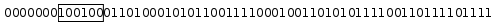

# Advanced Topics
This section covers few topics in details to give a deep insight into implementation of Hollow.

## Schema Parser

Hollow schemas can be serialized as Java Strings.  Calling `toString()` on a `HollowSchema` will produce a human-readable representation of the schema.  The following shows the String representations of all of the schemas from a `Movie`/`Actor` example data model:

```
Movie @PrimaryKey(id) {
    long id;
    int releaseYear;
    string title;
    SetOfActor actors;
}

SetOfActor Set<Actor> @HashKey(firstname, surname);

Actor {
    long id;
    String firstname;
    String surname;
}

String {
    string value;
}
```

These representations can be parsed using the `HollowSchemaParser`, and in turn can be used to initialize the state of a `HollowWriteStateEngine`:
```java
String allSchemas = /// a String containing all schemas

List<HollowSchema> schemas =
             HollowSchemaParser.parseCollectionOfSchemas(allSchemas);

HollowWriteStateEngine initializedWriteEngine =
             HollowWriteStateCreator.createWithSchemas(schemas);
```

!!! hint "Guiding Data Ingestion with a Data Model"
    For a generic data ingestion mechanism, loading the schemas from a text representation comes in handy.  For example, the [JSON to Hollow adapter](data-ingestion.md#json-to-hollow-adapter) requires a `HollowWriteStateEngine` which is preinitialized with a data model.  The data model can be configured in a text file, and loaded with the `HollowSchemaParser`.

Object schema definitions take the following form:
```
ObjectTypeName @PrimaryKey(fieldName1, fieldNameN) {
   FieldType1 fieldName1;
   FieldType2 fieldName2;
   ...
   FieldTypeN fieldNameN;
}
```

The primary key definition is optional and should be omitted if no primary key should be defined for a type.

Object schemas may define any of the following field types: `int`, `long`, `float`, `double`, `boolean`, `string`, `bytes`.  If a field has a type other than these, the field will be interpreted as a `REFERENCE` to another type of that name.

!!! warning "Lowercase Field Type Declarations"
    Note that the declarations for each of the inline field types are all lowercase (including `string`).  An uppercase letter in any of these types will be interpreted as a `REFERENCE` field to a separate type.


`List`, `Set`, and `Map` types use the following notation:

* `ListTypeName List<ElementTypeName>;`
* `SetTypeName Set<ElementTypeName> @HashKey(elementFieldOne, elementFieldTwo);`
* `MapTypeName Map<KeyTypeName, ValueTypeName> @HashKey(keyFieldOne, keyFieldTwo);`

`Set` and `Map` types may optionally define a [hash key](indexing-querying.md#hash-keys).  The hash key definition should be omitted if no hash key should be defined for a type.

Elements, keys, and values in collection record types cannot be inlined.  Whitespace is unimportant when parsing schema definitions.

## Low Level Input API

Although Hollow includes a few ready-made data ingestion utilities, other data ingestion utilities can be created.  Adding data into Hollow starts with a `HollowWriteStateEngine`.  We need to initialize a type state for each schema in our data model:
```java
HollowWriteStateEngine writeEngine = new HollowWriteStateEngine();

HollowObjectSchema movieSchema = new HollowObjectSchema("Movie", 3);
movieSchema.addField("id", FieldType.LONG);
movieSchema.addField("title", FieldType.REFERENCE, "String");
movieSchema.addField("releaseYear", FieldType.INT);

HollowObjectTypeWriteState movieState = new HollowObjectTypeWriteState(movieSchema);

writeEngine.addTypeState(movieState);
```

Once we’ve initialized our type states, we can add data into our state engine using HollowWriteRecords:
```java
HollowObjectSchema stringSchema = /// the String schema
HollowObjectSchema movieSchema = /// the Movie schema

HollowObjectWriteRecord titleRec = new HollowObjectWriteRecord(stringSchema);
HollowObjectWriteRecord movieRec = new HollowObjectWriteRecord(movieSchema);

titleRec.setString("value", "The Matrix");

int titleOrdinal = writeEngine.addObject("String", titleRec);

movieRec.setLong("id", 1);
movieRec.setReference("title", titleOrdinal);
movieRec.setInt("releaseYear", 1999);

writeEngine.addObject("Movie", movieRec);
```

Note that referenced records must be added prior to referencing records in order to obtain the referenced ordinals.

!!! tip "Reusing HollowWriteRecords"
    `HollowWriteRecord`s can be reused -- just be sure to call `reset()` before populating data from the next record.

Each schema type has its own `HollowTypeWriteState` and `HollowWriteRecord` implementation:
```java
HollowObjectSchema objectSchema = /// an Object schema
HollowListSchema listSchema = /// a List schema
HollowSetSchema setSchema = /// a Set schema
HollowMapSchema mapSchema = /// a Map schema

HollowObjectTypeWriteState objectTypeState = new HollowObjectTypeWriteState(objectSchema);
HollowListTypeWriteState listTypeState = new HollowListTypeWriteState(listSchema);
HollowSetTypeWriteState setTypeState = new HollowSetTypeWriteState(setSchema);
HollowMapTypeWritestate mapTypeState = new HollowMapTypeWriteState(mapSchema);

HollowObjectWriteRecord objectRec = new HollowObjectWriteRecord(objectSchema);
HollowListWriteRecord listRec = new HollowListWriteRecord();
HollowSetWriteRecord setRec = new HollowSetWriteRecord();
HollowMapWriteRecord mapRec = new HollowMapWriteRecord();
```

Using this API, it is possible to create a generic data ingestion mechanism from _any_ type of input source.

## Determining Populated Ordinals

Many lower-level operations require knowledge of the currently populated ordinals (i.e. those which are not holes), or knowledge of ordinals which were populated in state prior to the last delta application.  We can determine this from any _type state_ in a `HollowReadStateEngine`.  Both of these are useful, for example, if consumers wish to inspect exactly what has changed.

Each `HollowTypeReadState` underneath a `HollowReadStateEngine` contains the methods `getPopulatedOrdinals()` and `getPreviousOrdinals()`.  Each of these methods returns a `java.util.BitSet`.  The contents of returned `BitSet`s may be inspected, but should never be modified.

## Caching

Although a lot of effort has gone into minimizing the cost to read Hollow data, there is still inevitably a performance difference between accessing a field in a POJO and accessing a field in Hollow.  In general, this will not be a performance bottleneck, but in some rare cases the performance of tight inner loops may suffer on consumers.  

When there is a type with a low cardinality, we can instantiate and cache a POJO implementation for each ordinal, which can be used by consumers in tight inner loops.  This is accomplished by simply passing a `Set<String>` as the second constructor argument when instantiating a custom-generated Hollow API.  The elements in the Set should be the types to cache.

!!! danger "Avoid Premature Optimization"
    Caching should be used judiciously.  In all but the tightest of loops, caching will be unnecessary, and can even be detrimental to performance for types with a large cardinality.

## Hollow Heap Effects

### Double Snapshots

At times, a new state may be produced to which there is no available delta from the previous state.  When this _broken delta chain_ scenario occurs, consumers will by default attempt to load a snapshot to the latest state.  If a consumer loads a snapshot when it currently has a state loaded for the same dataset, we call this a _double snapshot_.  Double snapshots result in a doubling of the heap usage of your dataset.  This is because Hollow assumes that consumers may be actively using the current state, and it therefore must retain the current state to provide data while the next state is loaded.  Only after the next state is fully loaded can the old state be dropped.

If using the [`Hollow Consumer`](producer-consumer-apis.md#the-hollowconsumer), you can configure consumers to never attempt a double snapshot.  This is accomplished with a custom `DoubleSnapshotConfig`.  In this case, you should check for 'stuck' clients in a `RefreshListener`, so that you may take the appropriate operational action.

If a dataset is large, double snapshots should be avoided for performance reasons.  Double snapshots can be entirely avoided by [restoring](producer-consumer-apis.md#restoring-at-startup) a `HollowWriteStateEngine` at producer initialization time, and, if necessary, using the [`HollowStateDeltaPatcher`](tooling.md#patching) to operationally fill lost or missing deltas in the event an unforeseen issue occurs.

### Type Sharding

During a delta transition each individual record type builds the entire next state of the type in memory while the current state is retained to answer requests.  This means that the memory pool Hollow reserves needs to be large enough to compose an extra copy of the largest type.  This is a miniaturized version of the [double snapshot](advanced-topics.md#double-snapshots) problem.

To address this problem, large types can be transparently sharded into smaller individual chunks, each of which updates independently.  The effect of this feature is that Hollow only needs to retain a large enough memory pool to update the largest _chunk_ across all types.

Type sharding can be specified in two ways:  

* The recommended way is to specify a target max type shard size via a call to `setTargetMaxTypeShardSize(long bytes)` on a `HollowWriteStateEngine` prior to writing the first snapshot.  With this call, the number of shards will be automatically calculated based on the target excess memory pool size.
* Additionally, the number of shards for a type can be explicitly specified by annotating a POJO with the `@HollowShardLargeType` annotation when using the [`HollowObjectMapper`](data-ingestion.md#hollowobjectmapper) for data ingestion.  This can be useful if rapid growth is anticipated in a type.

Within a continuous delta chain, the type sharding configuration cannot be changed.  When a producer [restores](producer-consumer-apis.md#restoring-at-startup) the previously produced state at startup, then the restored `HollowWriteStateEngine` will always retain the sharding configuration of the prior state rather than recalculating based on the current size of each type.  Consequently, if the changes in a dataset over time results in a type sharding configuration which is highly suboptimal, it is recommended to start a new delta chain, which may require a double snapshot on all consumers, a simultaneous restart of all consumers, or a new [blob namespace](infrastructure.md#blob-namespaces) to which consumers can migrate over a period of time.

!!! warning "Backwards Compatibility"
    Type sharding is new in v2.1.0.  Consumers can read blobs produced by producers v2.1.0 and later _as long as type sharding is disabled_.
    If you are sure that all consumers are using v2.1.0 or later, it is safe to turn on type sharding.

    In order to avoid causing issues for early adopters, the default target max type shard size is currently set to `Long.MAX_VALUE`.  At a later time,
    this default will be changed to 25MB.


### Object Longevity

A Hollow object returned from a generated API contains a reference to the Hollow data store, and an ordinal.  For this reason, if a reference to a Hollow object is retained by the consumer for an extended period of time, and the underlying record changes unexpected results may begin to be returned from these references.  We call Hollow objects which were obtained from a no longer current state stale references.

It is best practice to __never__ cache Hollow objects.  However, if it somehow _cannot_ be guaranteed that Hollow Objects will never be cached at the consumer, and guaranteed protection against accidentally cached objects is necessary, then _object longevity_ can be enabled.

With object longevity, Hollow objects will, after an update, be backed by a reserved copy of the data at the time the reference was created.  This guarantees that even if a reference is held for a long time, it will continue to return the same data when interrogated.

When object longevity is defined, Two durations are defined:

* a grace period, and
* a usage detection period.  

The grace period is defined by its duration, in milliseconds, after a reference becomes stale.  During the grace period, usage of stale references is acceptable.  The usage detection period is defined by its duration, in milliseconds, after the grace period has expired.  During the usage detection period, usage of stale references is unexpected, but will not result in failed interrogations of Hollow objects.  After the usage detection period expires, data will be dropped if no usage was detected in the usage detection period.  If stale references are interrogated _after_ their backing data is dropped, then Exceptions will be thrown.

The `ObjectLongevityConfig`, injected into the `HollowConsumer` constructor, contains a few methods which are used to configure object longevity behavior:

* `boolean enableLongLivedObjectSupport()`: Whether or not object longevity is enabled.
* `long gracePeriodMillis()`: If object longevity is enabled, this returns the number of milliseconds before the usage of stale objects gets flagged.
* `long usageDetectionPeriodMillis()`: If long-lived object support is enabled, this defines the number of milliseconds, after the grace period, during which data is still available in stale references, but usage will be flagged.
* `boolean dropDataAutomatically()`: Returns whether or not to drop data behind stale references after the grace period + usage detection period has elapsed, as long as no usage was detected during the usage detection period.  This can be used to avoid memory leaks when long lived object support is enabled and stale references are cached, but unused.
* `boolean forceDropData()`: Returns whether or not to drop data behind stale references after the grace period + usage detection period has elapsed, even if usage was detected during the usage detection period.  This can be used to avoid memory leaks when long lived object support is enabled and stale references are cached and used.

Your implementation of the `ObjectLongevityConfig` may be backed by a dynamic configuration and safely change on live running consumers.  For example, `forceDropData()` may be operationally useful for boxes that are exhibiting memory leaks due to non-critical cached Hollow objects.

!!! hint "How It Works"
    When enabled, object longevity is achieved using the `HollowHistory` data structure, which results in a minimal heap overhead.

### Memory Pooling

Under normal operation, Hollow pools and reuses memory to minimize GC effects while updating data.  This pool of memory is kept as arrays on the heap. Each array in the pool has a fixed length.  When a long array or a byte array is required in Hollow, it will stitch together pooled array segments as a `SegmentedByteArray` or `SegmentedLongArray`.  These classes encapsulate the details of treating segmented arrays as contiguous ranges of values.


In shared-memory mode (only applicable to data consumers), Hollow uses a `BlobByteBuffer` abstraction which is basically an array of Java's `MappedByteBuffer`s stitched together to serve as one contiguous `ByteBuffer`.
During initial load a snapshot file is mmap-ed to virtual memory as a single `BlobByteBuffer`, and other `BlobByteBuffer`s are created as views into the underlying `BlobByteBuffer` to access parts of the Hollow dataset. Beyond an initial snapshot load, delta applications are currently not supported.

## Delta-Based Producer Input

The [Getting Started](getting-started.md) section of this documentation describes a producer which every so often reads the _entire dataset_ from some source of truth, re-adds all records to a `HollowWriteStateEngine`, then produces a delta based on the automatically discovered differences in the dataset since the prior cycle.  It is possible, however, that a producer may _receive_ an incoming stream of events which directly indicate the changes to a dataset, obviating the need to scan through the entire source of truth and re-add the entire dataset on each cycle.

If desired, a `HollowWriteStateEngine`’s state can be explicitly modified, rather than recreated, each cycle.  We start such a cycle by re-adding all of the records from the previous cycle to the state engine:

```java
HollowWriteStateEngine writeEngine = /// the state engine

writeEngine.prepareForNextCycle();
writeEngine.addAllObjectsFromPreviousCycle();
```

We’ll also need an indexed `HollowReadStateEngine`, which is updated in lock-step with the `HollowWriteStateEngine`.  The index can be used to retrieve the ordinals of records to be replaced.  These ordinals can be removed from the `HollowWriteStateEngine`:

```java
HollowObjectMapper mapper = new HollowObjectMapper(writeEngine);
HollowPrimaryKeyIndex idx =
                       new HollowPrimaryKeyIndex(readEngine, "Movie", "id");

HollowTypeWriteState movieTypeState = writeEngine.getTypeState("Movie");

List<MovieUpdateEvent> eventBatch = /// a batch of events

for(MovieUpdateEvent event : eventBatch) {
    int oldOrdinal = idx.getMatchingOrdinal(event.getMovie().getId());
    movieTypeState.removeOrdinalFromThisCycle(oldOrdinal);
    mapper.addObject(event.getMovie());
}
```

!!! danger "Watch out for Duplicates"
    Be careful, this process assumes that no two events will have the same movie ID in the same cycle.  You'll want to dedup the `eventBatch`.

This process may leave orphaned records around, since the call to `removeOrdinalFromThisCycle()` doesn’t remove any referenced records.  To solve this, the [`TransitiveSetTraverser`](tooling.md#transitive-set-traverser) can be used:
```java
List<MovieUpdateEvent> eventBatch = /// a batch of events

/// find the Movie ordinals to remove
BitSet removedMovieOrdinals = new BitSet();
for(MovieUpdateEvent event : eventBatch) {
    int oldOrdinal = idx.getMatchingOrdinal(event.getMovie().getId());
    removedMovieOrdinals.set(oldOrdinal);
}

/// initially the removal selection includes just Movies
Map<String, BitSet> removeRecords = new HashMap<>();
removeRecords.put("Movie", removedMovieOrdinals);

/// expand the selection to include any records referenced by selected Movies
TransitiveSetTraverser.addTransitiveMatches(readEngine, removeRecords);
/// but don't include records which are also referenced by unselected movies
TransitiveSetTraverser.removeReferencedOutsideClosure(readEngine, removeRecords);

/// remove everything in the selection
for(Map.Entry<String, BitSet> entry : removeRecords) {
    HollowTypeWriteState typeState = writeEngine.getTypeState(entry.getKey());
    int removeOrdinal = entry.getValue().nextSetBit(0);
    while(removeOrdinal != -1) {
        typeState.removeOrdinalFromThisCycle(removeOrdinal);
        removeOrdinal = entry.getValue().nextSetBit(removeOrdinal + 1);
    }
}
```

In the above code, each of the `Movie` ordinals to be replaced are added to a `BitSet`.  Then, the `TransitiveSetTraverser` is used to expand the collection of selected records by adding any records referenced by the selected `Movies`.  Then, the `TransitiveSetTraverser` is again used to deselect any child records which are also referenced by other Movies which were not selected for removal.  Finally, the selection is actually removed from the `HollowWriteStateEngine`.

## In-Memory Data Layout

Each record in Hollow begins with a fixed-length number of bits.  At the lowest level, these bits are held in long arrays using the class `FixedLengthElementArray`.  This class allows for storage and retrieval of fixed-length data in a range of bits.  For example, if a `FixedLengthElementArray` was queried for the 6-bit value starting at bit 7 in the following example range of bits:



The value `100100` in binary, or `36` in base 10, would be returned.

### Object Layout

An `OBJECT` record is a fixed set of strongly typed fields.  Each field is represented by a fixed-length number of bits.  Each record is represented by a fixed length number of bits equal to the sum of the bits required to represent each fields.  For each type, all fields of all records are packed into a single `FixedLengthElementArray`.  No bookkeeping data structures are required to locate a record -- the start bit for each record can is located by simply multiplying the number of bits per record times the record’s ordinal.


The number of bits used to represent a field which is one of the types (`INT`, `LONG`, `REFERENCE`) is exactly equal to the number of bits required to represent the maximum value contained in the field across all records.  The values for `INT` and `LONG` fields are represented using zig-zag encoding, so that smaller absolute values require fewer bits.  The values for `REFERENCE` fields are encoded as the referenced record’s ordinal, which along with the referenced type (from the schema) is sufficient to identify and locate the referenced record.

32 bits are used to represent a `FLOAT`, and 64 bits are used to represent a `DOUBLE`.

`STRING` and `BYTES` fields each get a separate byte array, into which the values for all records are packed.  The fixed-length value in these fields are offsets into the field’s byte array where the record’s value ends.  In order to determine the begin byte for the record with ordinal n, the offset encoded into the record with ordinal (n-1) is read.  The number of fixed length bits used to represent the offsets is exactly equal to the number of number of bits required to represent the maximum offset, plus one.

Each field type may be assigned a null value.  For `INT`, `LONG`, and `REFERENCE` fields, null is encoded as a value with all ones.  For `FLOAT` and `DOUBLE` fields, null is encoded as special bit sequences.  For `STRING` and `BYTES` fields, null is encoded by setting a designated null bit at the beginning of each field, followed by the end offset of the last populated value for that field.

### List Layout

A `LIST` is an ordered collection of records of a specific type.  `LIST` types are represented with two FixedLengthElementArrays.  We can refer to these arrays as the _offset array_ and the _element array_.

Each `LIST` type contains a single _element array_ into which the references to elements for all records are packed.  References are encoded as the ordinals of the element records, which is sufficient to identify and locate the record.  Each reference is represented using a fixed number of bits equal to the number of bits required to represent the maximum referenced ordinal across all records.  Each record is represented with a contiguous range of elements in the _element array_.  

The _offset array_ contains fixed-length offsets into the element array where the record’s elements end.  In order to determine the begin element for the record with ordinal n, the end value for the element (n-1) is read.  


Elements in a `LIST` record may not be null.

### Set Layout

A `SET` is an unordered collection of records of a specific type.  The records for `SET` elements are hashed into an open-addressed hash table.  `SET` types are represented with two `FixedLengthElementArrays`.  We can refer to these arrays as the _offset array_ and the _bucket array_.


Each `SET` element contains a single _bucket array_ into which the references to elements for all records are packed.  Each record is represented with a contiguous range of buckets in the _bucket array_.  The range of buckets for each record will contain an open-addressed hash table, with a linear probing hash collision resolution strategy.  The number of buckets for each record will be a power of two, and will be large enough such that all elements for the record will fit into those buckets with a load factor no greater than 70%.  Each bucket is represented using a fixed number of bits equal to the number of bits required to represent the maximum referenced ordinal across all records.  A populated bucket is encoded as the ordinal of the referenced record in that bucket.  To represent empty buckets, a sentinel value equal to all ones in binary is reserved.

The _offset array_ contains two fixed-length fields per record:  the size of the set, and the offset to the bucket where the record’s data ends.  Each of these fields is encoded using a fixed number of bits equal to the number of bits required to represent the field’s maximum value across all records.


Elements in a `SET` record may not be null.

### Map Layout

A `MAP` is an unordered collection of key/value pairs, where each key is a specific type, and each value type is a specific type.  The records for MAP elements are hashed into an open-addressed hash table.  `MAP` types are represented with two `FixedLengthElementArrays`.  We can refer to these arrays as the _offset array_ and the _bucket array_.

Each `MAP` type contains a single bucket array into which the references to keys and values for all records are packed.  Each record is represented with a contiguous range of buckets in the _bucket array_.  The range of buckets for each record will contain an open-addressed hash table, with a linear probing hash collision resolution strategy.  The number of buckets for each record will be a power of two, and will be large enough such that all key/value pairs for the record will fit into those buckets with a load factor no greater than 70%.  Each bucket is represented using a fixed number of bits equal to the number of bits required to represent the maximum referenced key ordinal, plus the number of bits required to represent the maximum referenced value ordinal.  A populated bucket contains two fixed length fields: the first field contains the ordinal of the referenced key, and the second field contains the ordinal of the referenced value.  Empty buckets are represented with a key field containing a reserved sentinel value equal to all ones in binary.

The _offset array_ contains two fixed-length fields per record:  the size of the map, and the offset to the bucket where the record’s data ends.  Each of these fields is encoded using a fixed number of bits equal to the number of bits required to represent the field’s maximum value across all records.


A `MAP` cannot contain null keys or values.

### Primary Key Index Layout

A primary key index is a single `FixedLengthElementArray`, which represents an open-addressed hash table of pointers to records of the given type.  The hash of each record is derived based on the fields designated in the primary key.  Each bucket in the hash table is represented using a fixed number of bits equal to the number of bits required to represent the maximum ordinal of the indexed type.  A populated bucket is encoded as the ordinal of the referenced record in that bucket.  To represent empty buckets, a sentinel value equal to all ones in binary is reserved.

When queried with a key, the index will hash the key, look in the corresponding bucket to find the ordinal of a record which also hashes to this key, then compare the referenced record’s key to the query.  When a matching record is found, the ordinal at that bucket is returned as the match.  Collisions are resolved with linear probing.  If after linear probing an empty bucket is encountered, no such record exists in the dataset.

### Hash Index Layout

A hash index is uses two `FixedLengthElementArrays`.  These arrays can be referred to as the _match array_ and the _select array_.  The _match array_ is an open-addressed hash table and contains buckets.  Like a primary key index, the match array does not re-encode the values of keys.  Instead, it retains pointers to existing records which may be used to retrieve the hashed keys.

Unlike a primary key index, it may not be sufficient to retain a single pointer to the indexed type and extract the hashed key from that record -- each record in a hash index may match multiple keys.  Instead, we retain 1-n pointers.  Each pointer will indicate a record through which one or more of the key fields may be unambiguously retrieved.  If multiple key fields may be unambiguously traversed to via a single type, then only a single pointer for the field group will be retained per bucket.  

Consider a scenario in which a hash index is used to index Movies by the nationalities and birth year of actors.  For the key `[“British”, 1972]`, the corresponding entry in the match array may contain a pointer to the `Actor` record for Idris Elba.  Although the record points to a specific `Actor`, the matching records for this entry will contain movies starring any British Actor born in 1972.

Each pointer field in the match array bucket references a specific type, and is encoded as the ordinal to which the bucket refers.  Each is represented using a fixed number of bits equal to the maximum ordinal in the referenced type.

In addition to pointers which allow us to look up the matching key, each bucket in the _match array_ includes the number of matching records, and an offset into the _select array_.  The _select array_ contains lists of ordinals to matching records.

When queried with a key, the index will hash the key, then look to the corresponding bucket in the _match array_.  The match pointers are used to compare the queried key with the matching key.  If a match is found, then the corresponding entries in the select array are returned as a `HollowHashIndexResult`.  Collisions are resolved with linear probing.  If after linear probing an empty bucket is encountered in the match array, no such record exists in the dataset.

### Shared memory mode
Traditionally, an entire Hollow dataset is loaded in the JVM heap. While this approach has its advantages, it also imposes eager loading of the underlying data and limits the data size to size of available physical memory. An alternative approach is to use memory mapping to map Hollow data to virtual memory and then eagerly or lazily load data into off-heap physical memory. Eager loading would memory lock the dataset and provide similar performance guarantee as traditional on-heap Hollow. Lazy loading would defer loading data to physical memory to when data is accessed (page fault would be incurred which would load 4k sized pages to physical memory, hot data would be retained in physical memory) thereby enabling faster application initialization and support for TB-scale datasets. Mapping Hollow data to shared memory also allows for memory deduplication across Hollow consumers on the same machine.

The shared memory implementation is largely future work, but a limited shared-memory based lazy load functionality has been implemented. When configured for shared memory mode, a consumer will perform an initial snapshot load, it will not apply delta transitions, and data structures tracking indices live on-heap. This limited functionality can be useful for local debugging with large Hollow datasets.