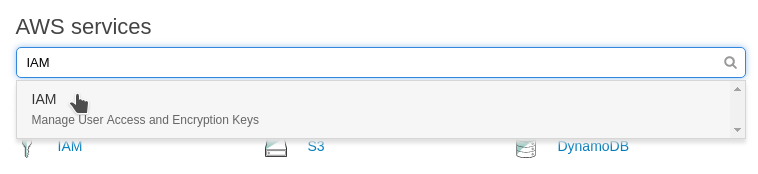
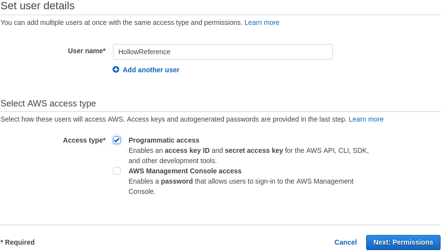
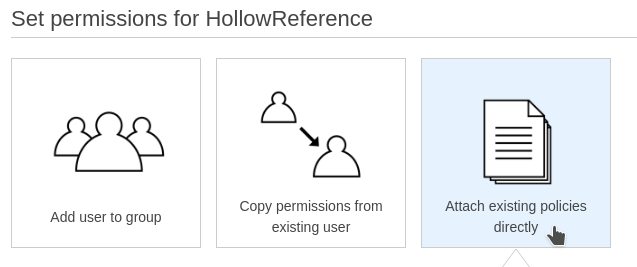
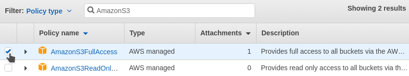
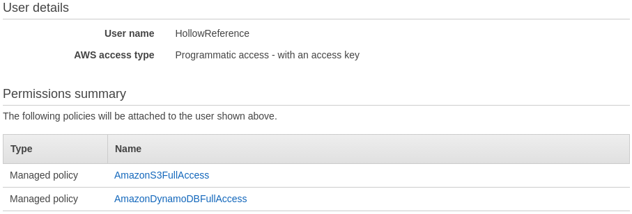
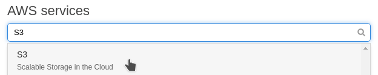
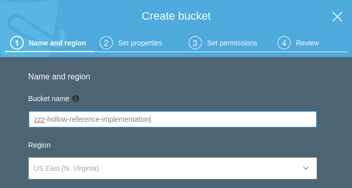
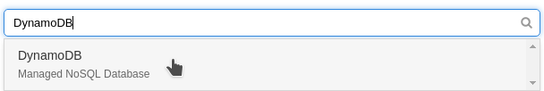
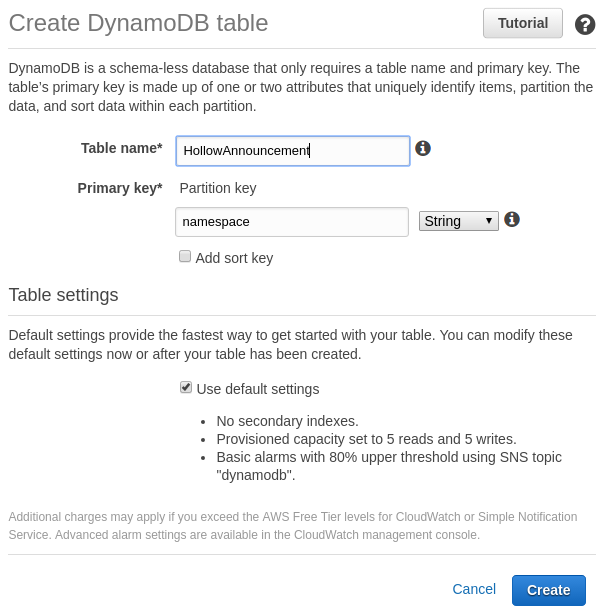
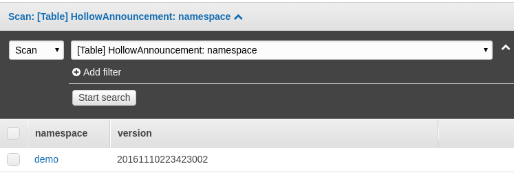

# Quick Start

Hollow has an available _reference implementation_, which is designed to get you up and running with a demo in minutes.  Then, we'll walk through swapping in a fully functional, production scalable, AWS-based infrastructure implementation in about an hour.

The reference implementation is a great starting point to integrate Hollow for your use case; it contains a simple mocked-up data model, which you can easily modify to suit your needs.

!!! hint "Learn by Doing"
    This __Quick Start Guide__ is placed at the beginning of the documentation as a starting point for those who prefer to "learn by doing".  If you'd prefer to gain a greater understanding of how everything fits together prior to jumping in, skip ahead to the [Getting Started](getting-started.md) guide, but do come back later.  


## Running the Demo

### Clone the Reference Implementation

Start by cloning the [netflix-hollow-reference-implementation](https://github.com/Netflix/hollow-reference-implementation) repo on GitHub:

```
git clone https://github.com/Netflix/hollow-reference-implementation.git
```

### Import into your IDE

Import the project into your IDE.  This project ships with both a `build.gradle` file and a `pom.xml` file, so you can either use a gradle plugin or a standard maven plugin to import the dependencies.

!!! note "Dependencies in Hollow"
    The core Hollow jar does not require or include _any_ third party dependencies.  The dependencies in the _reference implementation_ are required for infrastructure demonstration purposes.

### Start a Producer

The class `how.hollow.producer.Producer` contains a main method.  Run it.  This will be our data _producer_, and will write data to a directory _publish-dir_ underneath the temp directory.

You should see output like this:
```
I AM THE PRODUCER.  I WILL PUBLISH TO /tmp/publish-dir
ATTEMPTING TO RESTORE PRIOR STATE...
RESTORE NOT AVAILABLE
...
```

And you should have a folder `/tmp/publish-dir` with contents like this:

```
    17 announced.version
   370 delta-20161110185218001-20161110185228002
   604 delta-20161110185228002-20161110185238003
   385 reversedelta-20161110185228002-20161110185218001
   551 reversedelta-20161110185238003-20161110185228002
597567 snapshot-20161110185218001
597688 snapshot-20161110185228002
597813 snapshot-20161110185238003
```

### Start a Consumer

The class `how.hollow.consumer.Consumer` also contains a main method.  Run it.  This will be our data _consumer_, and will read data from the directory _publish-dir_ underneath the temp directory.  

You should see output like this:
```
I AM THE CONSUMER.  I WILL READ FROM /tmp/publish-dir
SNAPSHOT COMPLETED IN 45ms
TYPES: [Actor, Movie, SetOfActor, String]
DELTA COMPLETED IN 20ms
TYPES: [Movie, SetOfActor, String]
SNAPSHOT COMPLETED IN 1ms
TYPES: [Actor, Movie]
DELTA COMPLETED IN 12ms
TYPES: [Actor, Movie, SetOfActor, String]
DELTA COMPLETED IN 0ms
TYPES: [Movie]

```

### Inspecting the Data

That's it!  You now have a producer, which is reading data from a data source and publishing Hollow data to `/tmp/publish-dir`, and a consumer which is reading that data and keeping its internal state up to date.  Let's take a look at what the data actually looks like, and how it's changing over time.  The consumer started a _history_ server, so open up a browser and visit [http://localhost:7777](http://localhost:7777).

!!! note "Fake Data"
    In this demo case, there is no data source.  Instead, the producer is manufacturing some randomized fake data on the first cycle, and making some minor random modifications to that data for each cycle.  Inspect the package `how.hollow.producer.datamodel` to see the mock data model and how it is randomized.

## Plugging in Infrastructure

The demo we have so far is fully functional, but writing to and reading from a local disk directory is probably not realistic for a production implementation.  In the following few sections, we'll actually set up a simple AWS-based infrastructure which could easily scale to any production deployment.

!!! warning "Using AWS"
    This demonstration uses AWS because it is accessible to anyone, easy to set up, and extremely reliable.  In order to proceed, you'll need [an AWS account](http://aws.amazon.com), which is free to sign up for -- you only pay for the services you use.

    Even if you're not able to use the prescribed AWS-based infrastructure, running through the following steps will be useful to gain an understanding of how to swap in different infrastructure implementations for use with Hollow.

### Create a User

Once you've logged into your AWS account, select __Identity & Access Management__ from the AWS console:



Select __Users__, then __Add User__.  Enter a name in box (e.g. _HollowReference_).



Select the checkbox __Programmatic access__.  Click __Next:Permissions__ in the bottom right corner of the screen.

On the next page, Click __Attach existing policies directly__.  



We'll need _S3_ and _DynamoDB_ access for this user.  For now, let's give this user full access to S3.  Select the checkbox next to the policy named __AmazonS3FullAccess__:



Using the same interface, after the S3 policy checkbox is selected, on the same page search for and select the __AmazonDynamoDBFullAccess__ policy.

Click __Next: Review__.  You should see the following:



Click __Create User__.  Here you'll see an `Access Key ID` and a `Secret Access Key`.  Copy both of these strings and set them off to the side, we'll need them soon.

### Create an S3 Bucket

Back on the AWS console landing page, select S3:



Click __Create Bucket__, then create a bucket.  Select a unique name for your bucket.  Your bucket can be in any region, here we're using the _US Standard_ region:



Click __Next__.

Leave the defaults on the next couple of screens for now.  Click __Next__ twice more, then __Create Bucket__.

### Plug the Producer into S3

Now that we've set up our user and our S3 bucket, we can plug the producer into S3.  Open up the `Producer` class in the Hollow reference implementation project.  Modify the `main` method: swap the `Publisher` and `Announcer` implementations as follows, replacing `zzz-hollow-reference-implementation` with the bucket name you chose in the prior step:

```java
AWSCredentials credentials =
                new BasicAWSCredentials("<Access Key ID>", "<Secret Access Key>");

Publisher publisher =
                new S3Publisher(credentials, "zzz-hollow-reference-implementation", "demo");
Announcer announcer =
                new S3Announcer(credentials, "zzz-hollow-reference-implementation", "demo");

HollowProducer producer = HollowProducer.withPublisher(publisher)
                                        .withAnnouncer(announcer)
                                        .build();
```

Start the producer.  After a few cycles, inspect the `demo` folder in your S3 bucket to see what the producer is writing.

!!! warning "Watch your AWS Usage"
    The AWS meter is running.  Leaving this version of the producer running overnight could run up an AWS bill.  Shut the demo down once you're done!

!!! danger "Clean Up After Yourself"
    If you do ultimately choose to use S3 as your _blob storage_ infrastructure, be aware that this implementation does not automatically clean up data for you, which can result in increasing AWS bills.  You should have a cleanup strategy, which can be as simple as adding a __Lifecycle Rule__ to your bucket which will, for example, delete old data after 30 days.

### Plug the Consumer into S3

Now that our producer is writing data into S3, we need our consumers to read that data.  Open up the `Consumer` class in the Hollow reference implementation project.  Modify the `main` method: swap the `BlobRetriever` and `AnnouncementWatcher` implementations as follows, replacing `zzz-hollow-reference-implementation` with the bucket name you chose in the prior step:

```java
AWSCredentials credentials =
                new BasicAWSCredentials("<Access Key ID>", "<Secret Access Key>");

BlobRetriever blobRetriever =
        new S3BlobRetriever(credentials, "zzz-hollow-reference-implementation", "demo");
AnnouncementWatcher announcementWatcher =
        new S3AnnouncementWatcher(credentials, "zzz-hollow-reference-implementation", "demo");

Consumer consumer = HollowConsumer.withBlobRetriever(blobRetriever)
                                  .withAnnouncementWatcher(announcementWatcher)
					...
                                  .build();

```

Start the consumer.  You'll see the same output from the demo step, except now the Hollow input data is coming from S3.  

At this point, we have a fully distributed infrastructure.  You can start the producer on one machine, and start a consumer on many other machines, anywhere in the world.  Each of the consumers will update in lock-step each time the producer publishes changes.

!!! warning "Address already in use Exception"
    Note that the `Consumer` attempts to start a _history_ server on port 7777.  Because of this, only one `Consumer` can be running on a single machine at one time.  If you get a `java.net.BindException`, shut down the other `Consumer` and try again.

!!! note "Publishing Closer to the Consumer"
    Our implementation currently publishes to a single S3 bucket.  This is OK, but S3 buckets reside in specific AWS regions, and it is often beneficial to publish data closer to your consumers.  For example, if you have some consumers in the AWS region __US Standard__, and some in the region __Sydney__, then it makes sense to simultaneously publish to one bucket in each region, and have consumers read from the bucket closest to them.

### A Better Announcement Infrastructure

Our distributed infrastructure thus far leverages S3 for both a _blob store_ mechanism, and an _announcement_ mechanism.  Although S3 is perfectly suitable for blob storage, it's less well suited for announcement.  Instead, we can leverage DynamoDB for the announcement infrastructure, and achieve both improved scalability and better economics.

First, we need to create a DynamoDB table.  Back on the AWS console landing page, select DynamoDB:



Select __Create table__ and enter a Table name (e.g. _HollowAnnouncement_) and use _namespace_ as the __Partition key__:



Select __Create__.

### Plug the Producer into DynamoDB

Now that we've set up our DynamoDB table, let's swap it into our producer as our announcement mechanism.  Go back to the `Producer` class and modify the `main` method, swapping the `Announcer` implementation as follows:

```java
Announcer announcer = new DynamoDBAnnouncer(credentials, "HollowAnnouncement", "demo");
```

Start the producer.  After at least one cycle, you'll be able to scan the table and see a record indicating the currently announced version for our `demo` namespace:



### Plug the Consumer into DynamoDB

Now that our producer is announcing to DynamoDB, of course our consumer needs to look there for update directions.  Go back to the `Consumer` class and modify the `main` method, swapping the `AnnouncementWatcher` implementation as follows:

```java
AnnouncementWatcher announcementWatcher =
            new DynamoDBAnnouncementWatcher(credentials, "HollowAnnouncement", "demo");
```

Run the consumer.  You'll see the same output from prior steps, except now the Hollow input data is coming from S3, and the state version announcement is read from DynamoDB.

!!! note "Pinning The State"
    The provided `DynamoDBAnnouncementWatcher` can be _pinned_.  If the announcement item in DynamoDB contains a field `pin_version`, then the consumer will go to the version indicated in that field, instead of the version the producer announces.  See [Pinning Consumers](producer-consumer-apis.md#pinning-consumers) for more details about pinning data.

### Plug In Your Data Model

Congratulations!  You now have a living, breathing, fully production scalable implementation of Hollow in your hands.  All that's left to do is substitute your data model for the example provided.  The data model can be defined, as in this example, with a set of POJO classes.  Take this starting point and make it your own -- remove the classes underneath `how.hollow.producer.datamodel` and replace them with your data model.

!!! hint "Modeling Data with POJOs"
    The [`HollowObjectMapper`](data-ingestion.md#hollowobjectmapper) section of this document provides details about how to convert your POJO data model into Hollow.

Continue on to the [Getting Started](getting-started.md) guide to learn more about how the fundamental pieces of Hollow fit together, how to create a consumer API custom-tailored to your data model, and how to index your data for easy, efficient retrieval by consumers.
