# Insight Tools

Once your data is Hollow, you will be able to gain better insights into it.  Hollow ships with a number of useful tools for quickly gaining insights into your data, from broad patterns at high level, to zooming in to find and inspect specific individual records.

## Metrics

Implementing a `HollowMetricsCollector` allows to retrieve metrics from your data. Hollow collects metrics for producer and consumers by default which can be accessed by the `HollowMetricsCollector` on every cycle.

Common metrics for producer and consumer:

* `typeHeapFootprint`: provides the approximate heap footprint for each Type in your data. This is based on [Heap Usage Analysis](tooling.md#heap-usage-analysis)
* `typePopulatedOrdinals`: provides the number or ordinals per Type in your data.
* `currentVersion`: provides the current version of your data.
* `totalHeapFootprint`: provides the approximate heap footprint for your data. This is based on [Heap Usage Analysis](tooling.md#heap-usage-analysis)
* `totalPopulatedOrdinals`: provides the total number of ordinals in your data.

### Producer

In addition to the common metrics, hollow collects the following metrics from a producer:

* `cyclesCompleted`
* `cyclesSucceeded`
* `cycleFailed` 
* ` snapshotsCompleted` 
* `snapshotsFailed` 
* `deltasCompleted` 
* `deltasFailed` 
* `reverseDeltasCompleted` 
* `reverseDeltasFailed` 


#### Usage

```java
HollowProducer producer = HollowProducer.withPublisher(publisher)
                                                .withMetricsCollector(hollowMetricsCollector) 
                                                .build();
```

#### Prometheus Example

```java
import com.netflix.hollow.api.metrics.HollowMetricsCollector;
import com.netflix.hollow.api.metrics.HollowProducerMetrics;
import io.prometheus.client.Gauge;

class MyPrometheusProducerMetricsCollector extends HollowMetricsCollector<HollowProducerMetrics> {
    private static Gauge hollowConsumerGauge = Gauge
            .build()
            .name("hollowProducerMetrics")
            .labelNames("metric")
            .help("Hollow Producer Metrics")
            .register();


    private static void set(String metric, Double value) {
        hollowConsumerGauge.labels(metric).set(value);
    }

    private static final long kb = 1024;

    @Override
    void collect(HollowConsumerMetrics metrics) {
        //Common hollow metrics
        metrics.getTypeHeapFootprint().forEach((String type, Long heapCost) ->
                set(type + "_heap_cost_kb", heapCost / kb)
        );
        metrics.getTypePopulatedOrdinals().forEach((String type, Long ordinals)->
                set(type + "_domain_object_count", ordinals)
        );
        set("total_heap_cost_kb", metrics.getTotalHeapFootprint());
        set("total_domain_object_count", metrics.getTotalPopulatedOrdinals());
        set("current_version", metrics.getCurrentVersion());

        //Producer specific metrics
        set("cycles_completed", metrics.getCyclesCompleted());
        set("cycles_succeeded", metrics.getCyclesSucceeded());
        set("cycles_failed", metrics.getCycleFailed());
        set("snapshots_completed", metrics.getSnapshotsCompleted());
        set("snapshotsFailed", metrics.getSnapshotsFailed());
        set("deltas_completed", metrics.getDeltasCompleted());
        set("deltas_failed", metrics.getDeltasFailed());
    }
}
```

### Consumer

In addition to the common metrics, hollow collects the following metrics from a consumer:

* `refreshFailed`
* `refreshSucceeded`

#### Usage

```java
HollowConsumer
   .withBlobRetriever(blobRetriever)           
   .withMetricsCollector(hollowMetricsCollector) 
   .build();
```

#### Prometheus Example

```java
import com.netflix.hollow.api.metrics.HollowMetricsCollector;
import com.netflix.hollow.api.metrics.HollowConsumerMetrics;
import io.prometheus.client.Gauge;

class MyPrometheusConsumerMetricsCollector extends HollowMetricsCollector<HollowConsumerMetrics> {
    private static Gauge hollowConsumerGauge = Gauge
            .build()
            .name("hollowConsumerMetrics")
            .labelNames("metric")
            .help("Hollow Consumer Metrics")
            .register();


    private static void set(String metric, Double value) {
        hollowConsumerGauge.labels(metric).set(value);
    }

    private static final long kb = 1024;

    @Override
    void collect(HollowConsumerMetrics metrics) {
        //Common hollow metrics
        metrics.getTypeHeapFootprint().forEach((String type, Long heapCost) ->
                set(type + "_heap_cost_kb", heapCost / kb)
        );
        metrics.getTypePopulatedOrdinals().forEach((String type, Long ordinals)->
                set(type + "_domain_object_count", ordinals)
        );
        set("total_heap_cost_kb", metrics.getTotalHeapFootprint());
        set("total_domain_object_count", metrics.getTotalPopulatedOrdinals());
        set("current_version", metrics.getCurrentVersion());

        //Consumer specific metrics
        set("refresh_failed", metrics.getRefreshFailed());
        set("refresh_succeeded", metrics.getRefreshSucceded());
    }
}
```

## Blob Storage Manipulation

### Cleaning

Using the `BlobStorageCleaner` capability, it's possible to free up the blob storage and prevent running out of space because of old snapshots/deltas.

Hollow ships with `HollowFilesystemBlobStorageCleaner` which allows to only keep a given number of snapshots. It can be used in the following way:

```java
HollowProducer.Publisher publisher = new HollowFilesystemPublisher(publishDir);
HollowProducer.BlobStorageCleaner blobStorageCleaner = new HollowFilesystemBlobStorageCleaner(publishDir, 10);
HollowProducer producer = HollowProducer.withPublisher(publisher)
                                                .withBlobStorageCleaner(blobStorageCleaner)
                                                .build();
```

The integer `10` parameter will set the value for `numOfSnapshotsToKeep`.

It is also possible to add your own blob storage cleaner by extending `HollowProducer.BlobStorageCleaner` class and provide your own mechanism to clean snapshots/deltas/reverse deltas.

## Hollow Explorer

Hollow ships with a UI which can be used to browse and search records within any dataset.

### Explorer Setup

The `HollowExplorerUI` class in the _hollow-explorer-ui_ project is instantiated using either a `HollowReadStateEngine` or a [`HollowConsumer`](producer-consumer-apis.md#the-hollowconsumer) and a base URL path:
```java
HollowConsumer consumer = /// or your HollowReadStateEngine

HollowExplorerUI ui = new HollowExplorerUI("", consumer);
```

Incoming requests should be sent to the `handle` method in your `HollowExplorerUI` instance:
```java
public boolean handle(String target,
                      HttpServletRequest req,
                      HttpServletResponse resp) throws IOException
```

The `HollowExplorerUI` can be used in the context of an existing web container as shown above, _or_ can be invoked via the included `HollowExplorerUIServer`, which uses the Jetty HTTP Servlet Server:
```java
HollowConsumer consumer = /// or your HollowReadStateEngine

HollowExplorerUIServer server = new HollowExplorerUIServer(consumer, 8080);

server.start();
server.join();
```

The above call to `server.join()` will block forever.  While the above code is running, you can point a browser to _http://localhost:8080_ to explore your data.

### Explorer Usage

Upon opening your browser, you should see something like this:

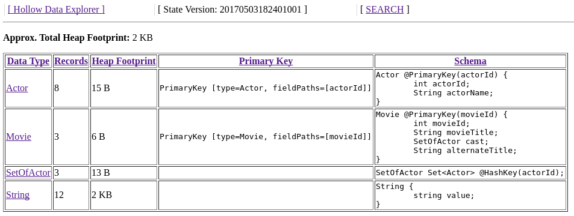

Click on a column header to sort by that column.  This view shows details about how many records exist for each type, and the approximate heap footprint of each type.

Click on a type to browse records.  We'll arrive at a screen like the following:

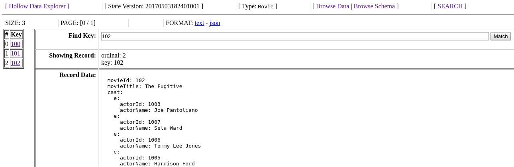

Clicking on the record keys on the left will display the corresponding record contents in the display field.  

Now imagine we wanted to search for movies in which Carrie-Anne Moss starred.  On this page, click the __Browse Schema__ link in the header to arrive at the following page:

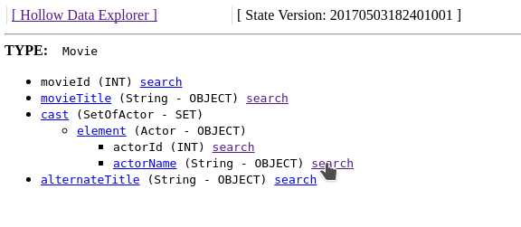

The view on this page is a collapsible tree-view of the current type's _schema_.  Each searchable field in this view will contain a __search__ link, which will prepopulate the _search_ page with the type and field name.  We can navigate to the `Actor.actorName` field and click __search__.  We will arrive on the _search_ page with the type and field name prepopulated:

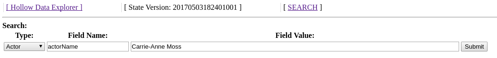

We can enter the field value we are looking for and click __Submit__, and we will see the number of matching records of each type.  Search query matches are not limited to the directly matching records -- they are automatically rolled up to include any referencing records as well:

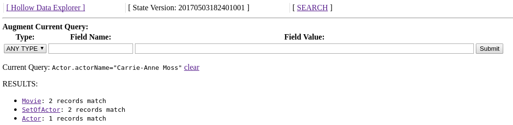

If we click on the type __Movie__ on this page, we'll be presented with the browse view again, but this time filtered to matching records:

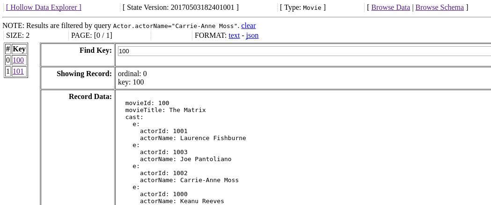

Search queries remain active in the browser session until cleared, and can be augmented to find the intersection of matches over multiple fields by entering multiple query parameters without clearing the existing ones in the session.  For example, if we want to find movies in which _both_ Carrie-Anne Moss and the Actor with ID `1001` starred, we can go back to the search page, and enter the appropriate criteria to augment our session's query.  The results will contain only records which match _both_ of these criteria:

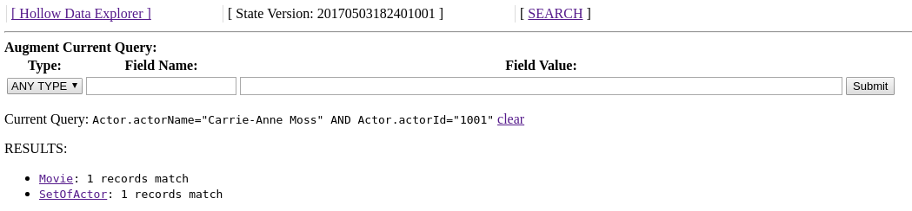


## History tool

Hollow ships with a UI which can be used to browse and search changes in a dataset over time.  The history tool provides the ability to get a bird’s eye view of all of the changes a dataset goes through over time, while simultaneously allowing for specific queries to see exactly how individual records change as the dataset transitions between states.  The history tool has proven to be enormously beneficial when investigating data issues in production scenarios.  When something looks incorrect, it’s easy to pinpoint exactly what changed when, which can vastly expedite data corrections and eliminate hours of potential detective work.

### History Setup

The `HollowHistoryUI` class in the _hollow-diff-ui_ project can be instantiated using a `HollowConsumer` and a base URL path:
```java
HollowConsumer consumer = /// or your HollowReadStateEngine

HollowHistoryUI ui = new HollowHistoryUI("", consumer);

```

The `HollowHistoryUI` will by default be configured to track all of the types for which primary keys have been specified.  By default, it will track changes through the latest rolling 1024 states.  This default can be changed with another parameter in the constructor.

Incoming requests should be sent to the `handle` method in your `HollowExplorerUI` instance:
```java
public boolean handle(String target,
                      HttpServletRequest req,
                      HttpServletResponse resp) throws IOException
```

The `HollowHistoryUI` can be used in the context of an existing web container as shown above, _or_ can be invoked via the included `HollowHistoryUIServer`, which uses the Jetty HTTP Servlet Server:
```java
HollowConsumer consumer = ...

HollowHistoryUIServer server = new HollowHistoryUIServer(consumer, 8080);

server.start();
server.join();
```

The above call to `server.join()` will block forever.  While the above code is running, you can point a browser to _http://localhost:8080_ to explore the history.

### History Usage

Upon opening your browser, you will see something like this:

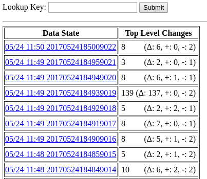

The history UI will track changes in types for which you have defined primary keys.  In this view, we're looking at the number of records which changed between _data states_.  The changes in each state are broken down here into _modifications_, _additions_, and _removals_.  Clicking on a state will show us a further breakdown of these changes by each top-level type:

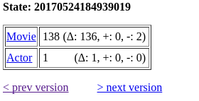

Clicking on a type will show us the individual records which changed:

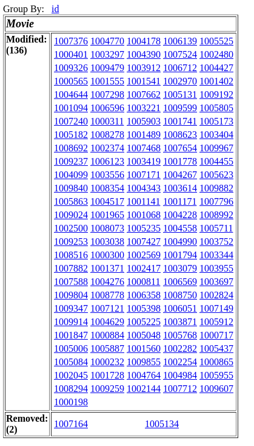

If we click on one of these records, we'll be able to inspect precisely what happened:

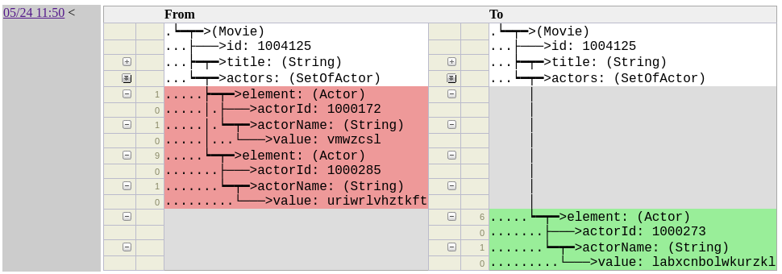

This is a collapsible tree-view in which the entire before/after state of the record is available, but only the differences are expanded by default.  Click on individual field names to expand/collapse them.

!!! note "Partially Expanded"
    The double-arrows in the example above mean the field is _partially expanded_ to highlight the diffs.  Clicking on it will fully expand the field.

Removals show up as red, additions as green, and modifications as yellow.  The following example shows a modified actor name:

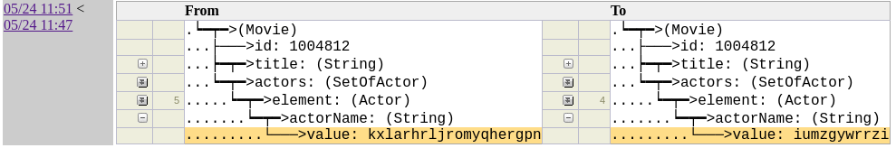

If this specific record key has changed in multiple states tracked by this history, those states will be highlighted on the left.  We can click back and forth through the changes to see how this record evolved over time.

We can also search for changes in specific records by their keys.  On each page in the history tool, a textbox is available in the header labeled __Lookup__.   Plugging in _a single field_ of a key of any type into this field will find matching diffs through the history:

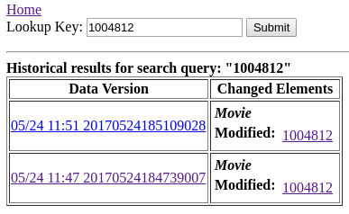

Clicking on individual records will bring us back to the object diff view page to see what was changed.


## Diff Tool

Just as the Hollow history tool UI makes the differences between any two _adjacent_ states in a delta chain readily accessible, the Hollow diff tool is used to investigate the differences between any two _arbitrary_ data states, even those which may exist in different delta chains.

This is especially useful as a step in a regular release cadence, as the differences between data states produced, for example, in a test environment and production environment can be evaluated at a glance.  Sometimes, unintended consequences of code updates may be discovered this way, which prevents production issues before they happen.

Initiating a diff between two data states is accomplished by loading both states into separate `HollowReadStateEngines` in memory, and then instantiating a `HollowDiff` and configuring it with the primary keys of types to diff.  For our `Movie`/`Actor` example:
```java
HollowConsumer testConsumer = /// load the test data
HollowConsumer prodConsumer = /// load the prod data

HollowReadStateEngine testData = testConsumer.getStateEngine();
HollowReadStateEngine prodData = prodConsumer.getStateEngine();

HollowDiff diff = new HollowDiff(testData, prodData);
diff.addTypeDiff("Movie", "id");
diff.addTypeDiff("Actor", "actorId");

diff.calculateDiffs();
```

A diff is calculated by matching records of the same type based on defined primary keys.  The unmatched records in both states are tracked, and detailed differences between field values in matching pairs are also tracked.

!!! hint "Primary Keys"
    The `HollowDiff` will, by default, automatically configure any primary keys which are defined in the `Object` schemas of your dataset.


Hollow includes a ready-made UI which can be applied to a `HollowDiff`.    The `HollowDiffUI` class can be used in the context of an existing web container, or can be invoked via the `HollowDiffUIServer`, which uses the Jetty HTTP Servlet Server:
```java
HollowDiff diff = /// build the diff

HollowDiffUIServer server = new HollowDiffUIServer(8080);
server.start();

server.addDiff("diff", diff);

server.join();
```

While the above code is running, you can point a browser to _http://localhost:8080_ to explore the diff.

## Heap Usage Analysis

One of the most important considerations when dealing with in-memory datasets is the heap utilization of that dataset on consumer machines.  Hollow provides a number of methods to analyze this metric.

Given a loaded `HollowReadStateEngine`, it is possible to iterate over each type and gather statistics about its approximate heap usage.  This is done in the following example:
```java
HollowReadStateEngine stateEngine = /// a populated state engine

long totalApproximateHeapFootprint = 0;

for(HollowTypeReadState typeState : stateEngine.getTypeStates()) {
    String typeName = typeState.getSchema().getName();
    long heapCost = typeState.getApproximateHeapFootprintInBytes();
    System.out.println(typeName + ": " + heapCost);
    totalApproximateHeapFootprint += heapCost;
}

System.out.println("TOTAL: " + totalApproximateHeapFootprint);
```
As shown above, information can be gathered about the total heap footprint, and also about the heap footprint of individual types.  This information can be helpful in identifying optimization targets.  This technique can also be used to identify how the heap cost of individual types changes over time, which can provide early warning signs about optimizations which should be targeted proactively.

## Usage Tracking

Hollow tracks usage, which can be investigated at runtime.  By default, this functionality is turned off, but it can be enabled by injecting a HollowSamplingDirector into a Hollow API in a running instance.  You can use the TimeSliceSamplingDirector implementation, which will by default record every access which happens during 1ms out of every second:

```java
MovieAPI api = /// a custom-generated API

TimeSliceSamplingDirector samplingDirector = new TimeSliceSamplingDirector();
samplingDirector.startSampling();

api.setSamplingDirector(samplingDirector);
```

Once this is enabled, and some time has passed for samples to be gathered, the results can be collected for analysis:
```java
for(SampleResult result : api.getAccessSampleResults()) {
    if(result.getNumSamples() > 0)
        System.out.println(result.getIdentifier() + ": " +
                                                  result.getNumSamples());
}
```

## Transitive Set Traverser

The `TransitiveSetTraverser` can be used to find children and parent references for a selected set of records.  We start with an initial set of selected records by ordinal, represented with a `Map<String, BitSet>`.  Entries in this map will indicate a type, plus the ordinals of the selected records:
```java
Map<String, BitSet> selection = new HashMap<String, BitSet>();

/// select the movies with IDs 1 and 6.
BitSet selectedMovies = new BitSet();
selectedMovies.set(movieIdx.getMatchingOrdinal(1));
selectedMovies.set(movieIdx.getMatchingOrdinal(6));

selection.put("Movie", movies);
```

We can add the references, and the _transitive references_ of our selection.  After the following call returns, our selection will be augmented with these matches:
```java
TransitiveSetTraverser.addTransitiveMatches(readEngine, selection);
```

!!! note "Transitive References"
    If A references B, and B references C, then A transitively references C

Given a selection, we can also add any records which reference anything in the selection.  This is essentially the opposite operation as above; it can be said that `addTransitiveMatches` traverses down, while `addReferencingOutsideClosure` traverses up.  After the following call returns, our selection will be augmented with this selection:
```java
TransitiveSetTraverser.removedReferencedOutsideClosure(readEngine, selection);
```

## Dataset Manipulation Tools

### Filtering

Sometimes, a dataset will be of interest to multiple different types of consumers, but not all consumers may be interested in all aspects of a dataset.  In these cases, it’s possible to omit certain types and fields from a client’s view of the data.  This is typically done to tailor a consumer’s heap footprint and startup time costs based on their data needs.

Using our `Movie`/`Actor` example above, if there was a consumer which was interested in `Movie` records, but not `Actor` records, that consumer might construct a consumer-side data filter configuration in the following way:
```java
HollowFilterConfig config = new HollowFilterConfig(true);
config.addField("Movie", "actors");
config.addType("ListOfActor");
config.addType("Actor");
```

The boolean `true` parameter in the constructor above indicates that this is an exclusion filter.  We could accomplish the same goal using an inclusion filter:
```java
HollowFilterConfig config = new HollowFilterConfig(false);
config.addField("Movie", "id");
config.addField("Movie", "title");
config.addField("Movie", "releaseYear");
config.addType("String");
```

The difference between these two configurations is how the filter behaves as new types and fields are added to the data model.  The exclusion filter will not exclude them by default, whereas the inclusion filter will.

A filter configuration is applied to a `HollowConsumer` at read time:
```java
HollowConsumer consumer = HollowConsumer.withBlobReader(reader)
                                        .withFilterConfig(config)
                                        .build();
```

### Combining

The `HollowCombiner` is used to copy data from one or more copies of hollow datasets in `HollowReadStateEngine`s into a single `HollowWriteStateEngine`.  If each of the inputs contain the same data model, the following is sufficient to combine them:
```java
HollowReadStateEngine input1 = /// an input
HollowReadStateEngine input2 = /// another input

HollowCombiner combiner = new HollowCombiner(input1, input2);
combiner.combine();

HollowWriteStateEngine combined = combiner.getCombinedStateEngine();
```

By default, the combiner will copy all records from all types from the inputs to the output.  We can direct the combiner to exclude certain records from copying using a `HollowCombinerCopyDirector`.  The interface for a `HollowCombinerCopyDirector` allows for making decisions about copying individual records during a combine operation by implementing the following method:
```java
public boolean shouldCopy(HollowTypeReadState typeState, int ordinal);
```

If this method returns false, then the copier will not attempt to directly copy the matching record.  However, if the matching record is referenced via another record for which this method returns true, then it will still be copied regardless of the return value of this method.

The most broadly useful provided implementation of the `HollowCombinerCopyDirector` is the `HollowCombinerExcludePrimaryKeysCopyDirector`, which can be used to specify record exclusions by primary key.  For example, if we wanted to create a copy of a state engine with the `Movie` records with ids 100 and 125 excluded:
```java
HollowReadStateEngine input = /// an input
HollowPrimaryKeyIndex idx = new HollowPrimaryKeyIndex(input, "Movie", "id");

HollowCombinerExcludePrimaryKeysCopyDirector director =
                          new HollowCombinerExcludePrimaryKeysCopyDirector();

director.excludeKey(idx, 100);
director.excludeKey(idx, 125);

HollowCombiner combiner = new HollowCombiner(director, input);
combiner.combine();

HollowWriteStateEngine result = combiner.getCombineStateEngine();
```

It’s possible that while combining two inputs, both may have a record of the same type with the same primary key.  This violation of the uniqueness constraint of a primary key can be avoided by informing the combiner of the primary keys in a data model prior to the combine operation:
```java
HollowCombiner combiner = new HollowCombiner(input1, input2);

combiner.setPrimaryKeys(
        new PrimaryKey("Movie", "id"),
        new PrimaryKey("Actor", "actorId")
);

combiner.combine();
```

If multiple records exist in the inputs matching a single value for any of the supplied primary keys, then only one such record will be copied to the output.  The specific record which is copied will be the record from the input was supplied earliest in the constructor of the `HollowCombiner`.  Further, if any record references another record which was omitted because it would have been duplicate based on this rule, then that reference is remapped in the output state to the matching record which was chosen to be included.

### Splitting

A single dataset can be sharded into multiple datasets using a `HollowSplitter`.  The `HollowSplitter` takes a `HollowSplitterCopyDirector`, which indicates:

* _top level_ types to split,
* the number of shards to create, and
* which shard to send individual records.

!!! note "Top Level Types"
    Top level types are those which are not referenced by any other types.  In our `Movie`/`Actor` example, `Movie` is a top-level type, but `Actor` is not.

Two default implementations of `HollowSplitterCopyDirector` are available:

* `HollowSplitterOrdinalCopyDirector`
* `HollowSplitterPrimaryKeyCopyDirector`.  

These directors will split top-level types among a specified number of shards either by ordinals or primary keys, respectively.  When splitting by ordinal, a record with a specific primary key may jump between shards when it is modified, while with the primary key director a specific primary key will consistently hash to the same shard.

Our `Movie`/`Actor` example may use the splitter to split a dataset into four shards with the following invocation:
```java
HollowReadStateEngine stateEngine = /// a state engine

HollowSplitterCopyDirector director =
                            new HollowSplitterOrdinalCopyDirector(4, "Movie");

HollowSplitter splitter = new HollowSplitter(director, stateEngine);
splitter.split();


for(int i=0; i<4; i++) {
    HollowWriteStateEngine shard = splitter.getOutputShardStateEngine(i);
}
```

## State Manipulation Tools

### Patching

Using the `HollowWriteStateEngine`’s restore capability, it’s possible to produce deltas forever, so that consumers never have to load a snapshot after initialization.  However, if environmental hiccups cause a producer to fail to publish a delta, or if a delta is lost, or if it’s desired to publish a delta between non-adjacent states, then the `HollowStateDeltaPatcher` may be used to produce deltas between two arbitrary states within the same delta chain.

The `HollowStateDeltaPatcher` must produce _two_ delta transitions to create a transition between arbitrary states.  This is because non-adjacent states may have different records occupying the same ordinals.  Since no ordinal may be removed and added in adjacent states, the state patcher must create an intermediate state in which modified records do not share any ordinals.

See the `HollowStateDeltaPatcher` javadocs for usage details.
