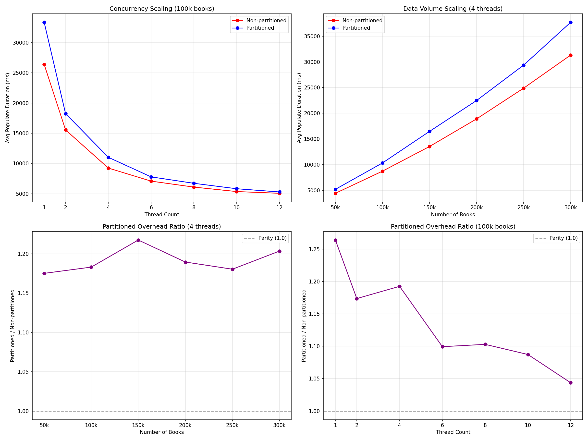

# hollow-perf-producer

Producer cycle benchmarking module for comparing Hollow producer performance with and without partitioned ordinal maps.

## What changed

- New `hollow-perf-producer` module added to the build
- `settings.gradle` updated with `include 'hollow-perf-producer'`

## Module structure

16 Java source files across 2 packages:

- **Core (4 classes):** `ProducerPerfTest` (main), `PerfMetrics`, `PerfMetricsListener`, `DeterministicDataPopulator`
- **Model (12 POJOs):** `Book`, `BookId`, `Country`, `BookImages`, `BookMetadata`, `Chapter`, `ChapterId`, `ChapterInfo`, `Scene`, `Art`, `Artist`, `Genre`

The data model is a `Book` entity graph with nested metadata, chapters, scenes, art, and artists — designed to exercise a realistic mix of Hollow type kinds (objects, lists, sets, maps, inlined types, enums, byte arrays).

### Data model diagram

```
┌─────────────────────────────────────────────────────────────┐
│  Book  @HollowPrimaryKey(id, country)                       │
│─────────────────────────────────────────────────────────────│
│  id       : BookId                                          │
│  country  : Country  [@HollowInline]                        │
│  images   : BookImages                                      │
│  metadata : BookMetadata                                    │
└────┬──────────┬───────────────────────┬─────────────────────┘
     │          │                       │
     ▼          ▼                       ▼
┌─────────┐ ┌───────────┐  ┌──────────────────────────────┐
│ BookId   │ │ Country   │  │ BookMetadata                  │
│──────────│ │───────────│  │──────────────────────────────│
│ value:int│ │ id:String │  │ name    : String              │
└──────────┘ │ (inlined) │  │ genre   : Genre (enum)        │
             └───────────┘  │ chapters: List<Chapter>       │
                            └───────────┬──────────────────┘
                                        │
┌───────────────────────────────────────┘
│
▼
┌─────────────────────────────────────────┐
│ Chapter  @HollowPrimaryKey(chapterId)   │
│─────────────────────────────────────────│
│ chapterId  : ChapterId                  │
│ chapterInfo: ChapterInfo                │
│ scenes     : List<Scene>                │
└──┬──────────────┬───────────────┬───────┘
   │              │               │
   ▼              ▼               ▼
┌───────────┐ ┌──────────────┐ ┌─────────────────────────┐
│ ChapterId │ │ ChapterInfo  │ │ Scene                    │
│───────────│ │──────────────│ │─────────────────────────│
│ val:String│ │ bookId :BookId│ │ description: String      │
└───────────┘ │ pages  : int │ │ popularity : long        │
              │ content:byte[]│ │ characters : Set<String> │
              └──────────────┘ └─────────────────────────┘


┌──────────────────────────────────────┐
│ BookImages                           │
│──────────────────────────────────────│
│ art: Map<String, List<Art>>          │
│      (size label -> art list)        │
└──────────────────┬───────────────────┘
                   │
                   ▼
           ┌────────────────────────┐
           │ Art                     │
           │────────────────────────│
           │ id            : String  │
           │ artist        : Artist  │
           │ timeOfCreation: long    │
           │ size          : long    │
           └───────────┬────────────┘
                       │
                       ▼
             ┌──────────────────────────────────┐
             │ Artist  @HollowPrimaryKey(name)  │
             │──────────────────────────────────│
             │ name: String                     │
             │ city: String                     │
             └──────────────────────────────────┘


┌──────────────────────────────────────┐
│ Genre (enum)                         │
│──────────────────────────────────────│
│ ACTION, CLASSIC, ART, TRAVEL, GUIDE, │
│ PSYCHOLOGY, BUSINESS, DRAMA, POETRY, │
│ ROMANCE, FICTION                     │
└──────────────────────────────────────┘
```

### Hollow type coverage

| Hollow Type | Exercised By |
|---|---|
| **OBJECT** | `Book`, `BookId`, `BookMetadata`, `Chapter`, `ChapterId`, `ChapterInfo`, `Scene`, `Art`, `Artist`, `BookImages` |
| **LIST** | `List<Chapter>` in BookMetadata, `List<Scene>` in Chapter, `List<Art>` in BookImages map values |
| **SET** | `Set<String>` (characters) in Scene |
| **MAP** | `Map<String, List<Art>>` in BookImages |
| **INLINE** | `Country.id` via `@HollowInline` (stored directly in parent rather than as a separate type) |
| **ENUM** | `Genre` |
| **BYTES** | `byte[] content` in ChapterInfo |

### Primary keys

- **Book** — composite key `(id, country)` — each book is unique per country
- **Chapter** — key `(chapterId)`
- **Artist** — key `(name)` — artists are shared across books, enabling deduplication

### Ownership graph

`Book` is the root. Two independent sub-trees branch off:

1. **Content branch:** `BookMetadata` -> `Chapter` -> `ChapterInfo` + `Scene`
2. **Images branch:** `BookImages` -> `Art` -> `Artist`

`BookId` is referenced in two places (`Book.id` and `ChapterInfo.bookId`), creating a cross-reference between the branches.

## CLI arguments

| Argument | Default | Description |
|---|---|---|
| `--label` | `test` | Label for the results file |
| `--num-books` | `50000` | Number of distinct books |
| `--countries-per-book` | `10` | Books multiplied per country |
| `--chapters-per-book` | `3` | Chapters per book |
| `--chapter-content-size` | `1024` | Byte array size in each chapter |
| `--scenes-per-chapter` | `2` | Scenes per chapter |
| `--characters-per-scene` | `3` | Characters per scene |
| `--num-artists` | `5000` | Total number of artists |
| `--adds-per-cycle` | `500` | New book IDs added per delta cycle |
| `--removes-per-cycle` | `200` | Books removed per delta cycle |
| `--modifications-per-cycle` | `2000` | Books modified per delta cycle |
| `--num-cycles` | `20` | Number of producer cycles to run |
| `--num-runs` | `2` | Benchmark runs (first is warmup when >1) |
| `--threads` | `1` | Thread pool size for parallel population |
| `--blob-path` | `/tmp/hollow-perf-data` | Directory for blob output |
| `--partitioned` | `false` | Enable partitioned ordinal map |

## How to run

### Baseline (master branch)

```bash
git stash  # or checkout master
./gradlew :hollow-perf-producer:run --args='--label baseline --num-cycles 20 --num-runs 2'
```

### Feature branch (partitioned ordinal map)

```bash
git checkout azeng-scaling-baom-2
./gradlew :hollow-perf-producer:run --args='--label partitioned --partitioned true --num-cycles 20 --num-runs 2'
```

### Quick sizing test

Run a short test to verify everything works before a full benchmark:

```bash
./gradlew :hollow-perf-producer:run --args='--label quick --num-books 1000 --countries-per-book 2 --num-cycles 3 --num-runs 1'
```

## Results

Results are written to `perf-results-<label>.json` in the module's working directory.

### JSON output format

```json
{
  "label": "test",
  "timestamp": "2025-01-01T00:00:00Z",
  "config": {
    "numBooks": 50000,
    "countriesPerBook": 10,
    "chaptersPerBook": 3,
    "chapterContentSize": 1024,
    "numCycles": 20,
    "numRuns": 2,
    "threads": 1,
    "partitionedOrdinalMap": false
  },
  "runs": [
    {
      "runIndex": 0,
      "cycles": [
        {
          "cycleNum": 0,
          "version": 1234567890,
          "cycleDurationMs": 5000,
          "populateDurationMs": 3000,
          "publishDurationMs": 1500,
          "blobStagingMs": { "SNAPSHOT": 800, "DELTA": 200 },
          "blobPublishMs": { "SNAPSHOT": 400, "DELTA": 100 },
          "snapshotSizeBytes": 104857600,
          "heapUsedBytes": 536870912
        }
      ],
      "restore": {
        "restoreDurationMs": 2000,
        "restoredVersion": 1234567890,
        "postRestoreCycleDurationMs": 4500
      }
    }
  ],
  "summary": {
    "avgCycleDurationMs": 4800,
    "p50CycleDurationMs": 4700,
    "p95CycleDurationMs": 5200,
    "avgPopulateDurationMs": 2900,
    "avgPublishDurationMs": 1400
  }
}
```

The **summary** section aggregates across non-warmup runs, giving avg/p50/p95 for cycle duration and averages for populate and publish phases.

## Experiment Results

Results from comparing **non-partitioned** (baseline) vs **partitioned ordinal map** populate performance. All times are `avgPopulateDurationMs` averaged across non-warmup runs.

Common config: countriesPerBook=10, chaptersPerBook=3, chapterContentSize=1024, scenesPerChapter=2, charactersPerScene=3, numArtists=5000.

### Thread Scaling (100k books, 3 cycles, 6 runs)

| Threads | Baseline (ms) | Partitioned (ms) | Overhead |
|---------|---------------|-------------------|----------|
| 1       | 26,398        | 33,368            | +26.4%   |
| 2       | 15,555        | 18,256            | +17.4%   |
| 4       | 9,240         | 11,019            | +19.2%   |
| 6       | 7,076         | 7,779             | +9.9%    |
| 8       | 6,090         | 6,717             | +10.3%   |
| 10      | 5,351         | 5,818             | +8.7%    |
| 12      | 5,065         | 5,286             | +4.4%    |

### Data Volume Scaling (4 threads, 3 cycles, 6 runs)

| Books | Baseline (ms) | Partitioned (ms) | Overhead |
|-------|---------------|-------------------|----------|
| 50k   | 4,413         | 5,186             | +17.5%   |
| 100k  | 8,722         | 10,319            | +18.3%   |
| 150k  | 13,526        | 16,469            | +21.8%   |
| 200k  | 18,901        | 22,484            | +19.0%   |
| 250k  | 24,890        | 29,381            | +18.0%   |
| 300k  | 31,340        | 37,718            | +20.3%   |

### Key Findings

1. **Overhead decreases with concurrency**: From +26% at 1 thread down to +4% at 12 threads. The partitioned ordinal map's single-threaded merge phase becomes proportionally smaller as parallel populate work increases.
2. **Overhead is stable across data volumes**: Stays in the 17-22% range regardless of dataset size (at 4 threads), indicating the overhead scales linearly with data.
3. **Both implementations scale well with threads**: Baseline drops from 26.4s (1 thread) to 5.1s (12 threads); partitioned drops from 33.4s to 5.3s — a ~5x speedup for both.

### Plots



- **Top-left**: Absolute populate time vs thread count — both curves converge at higher thread counts
- **Top-right**: Absolute populate time vs data volume — linear scaling for both
- **Bottom-left**: Overhead ratio vs data volume — flat around 1.18-1.21x
- **Bottom-right**: Overhead ratio vs thread count — decreasing from 1.26x to 1.04x
