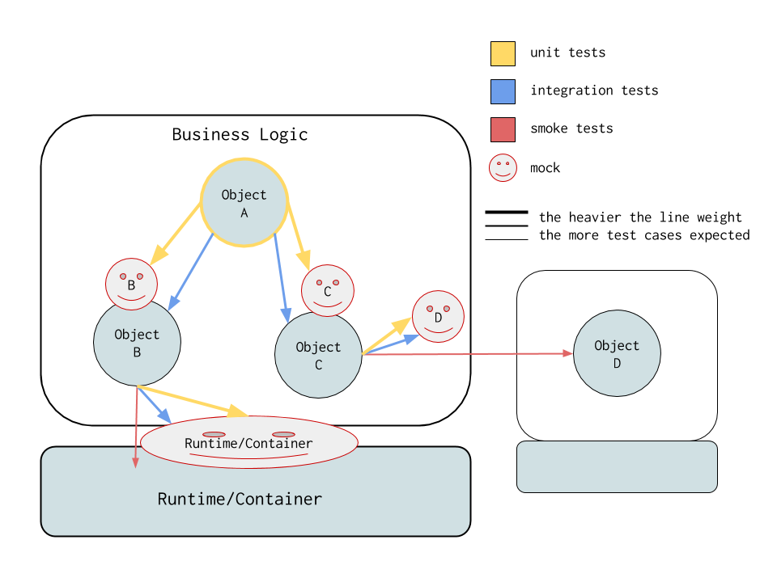

# Testing Guide

This guide discusses our service testing guidelines. We hope it will help you make the testing decisions most suitable for your project.

The diagram below shows how we'd like to go about testing our business logic in an example service.

A bit of info about the diagram:

- We have a service where our business logic consists of objects A, B, C.
- Object A (that we own), depends on objects B and C (we own both).
- Object B depends on more objects in the Runtime/Container (Jersey, Servlet, Governator, Properties, Discovery etc.) that we don't own.
- Object C talks to another service that has business logic object D via a client (e.g., VideoMetadata, CassandraSession etc.) that we don't own.
- As such, a request to our service will be processed by code that we own and don't own.

We organize our test cases in 3 different categories:

- Unit Tests
- Integration Tests
- Smoke Test

We explain each category below.

## Unit Tests
We consider *unit tests* those where you test one particular object in isolation by mocking its direct dependencies.

In order to facilitate this test model you should try to:

- Use dependency injection (e.g., Guice) where you pass all the dependencies of an instance as explicit parameters.
- As such, you do *not* use static initialization.
- Expect *interfaces* of your dependencies, not implementations.
- Provide *interfaces* for each dependency that you own.

In the diagram above, object A depends on objects B and C. During a unit test, we initialize A with mocks of B and C instead of real instances. Both B and C have interfaces and implementations of these interfaces.

If you have many input/output combinations you need to test, we recommend you do this during unit testing. The [Data Provider](https://github.com/TNG/junit-dataprovider/wiki/Features) pattern helps make that easier. If you are familiar with Groovy, you may also use [Spock](http://spockframework.github.io/spock/docs/1.1-rc-1/index.html) (not in the generator currently).

### Example
Your generated test for your Jersey resource under `resource.v1` is an example of how proper dependency injection helps to fully isolate the test object inside the unit test with mocks. Notice that there is no need for using Guice in the unit test because we have direct links to mocks.

## Integration Tests
Many times we want to test a code path spanning multiple objects that our business logic owns and want to make sure they all integrate correctly in isolation or that they interact correctly with external objects. We do this via *integration* tests using a combination of real objects, mocks, and spies.  

In the above diagram we may want to test how A, B, and C interact but not deal with Runtime objects or the external object D. We therefore mock D and the Runtime objects. If we want to check conditions related to interactions between the objects we own then we can wrap B or C with a spy.

In order to facilitate this test model you should:

- Group your bindings by functionality inside your dependency injection framework. For example, in Guice you should have multiple modules, each one wiring up dependencies that are closely related. For example, maybe object B is wired via a DBModule which takes care of wiring up your DB. Object C is wired via a PaymentsModule which takes care of your payment business logic. So you can install the PaymentModule in your integration test but not install the DBModule because we mock the DB interface. Then you can write a different integration test where you mock the Payments instead.
- Understand the contract with external dependencies of the objects you own. For example, in the diagram above we don't need to talk to the real object D. We can mock that in our integration test but our mock needs to be reasonable. This can be tricky if the library you use doesn't document its behavior properly. This is where sometimes if D is complicated you may need to resort to a smoke test that calls the real D implementation.

We recommend you use the `com.netflix.governator:governator-test-junit` framework to simplify writing your integration tests. This gives you the advantage to jump from real implementations of external objects to mocking them with very few code changes.

### Example
The `runtime-swagger` library uses the `governator-test-junit` framework to mock out an external dependency in an integration test [here](https://stash.corp.netflix.com/projects/CPIE/repos/runtime-swagger/browse/runtime-swagger-lifecycle/src/test/java/com/netflix/runtime/swagger/lifecycle/RuntimeSwaggerModuleTest.java).

## Smoke Test
A *smoke* test loads up the whole service with its real dependencies and makes requests to check if the service is working end-to-end. Many engineers feel this is the "real" test and typically have tons of test cases in there to thoroughly test their logic. One problem with this approach, however, is that testing your business logic like that is sometimes unreliable and slow because real implementations of your dependencies tend to be clients that talk to other services over the network or rely on some piece of infrastructure being present in the environment that triggers the test. Sometimes this leads to one of the following outcomes over the lifetime of the project:

1. Low code coverage (because it takes a long time for the test to finish).
2. Disabling test or ignoring failures (because it fails sometimes). 
3. Triggering the test manually under human supervision which leads to potentially bad releases.

For this reason, proper unit testing is important to get code coverage. We recommend there is only one *smoke* test per service and that smoke test simply loads the service and tests that it gets a response for the endpoints it is serving. Nothing more complicated than that, as the diagram above shows. 

We recommend you use the `com.netflix.governator:governator-test-junit` framework to make your test setup very easy. Your generated service comes with it.

(If you feel your service and test environment do not have the limitations mentioned, you may use the smoke test infrastructure more extensively. Up to you. You can always convert those tests into **Integration Tests** if you use the `governator-test-junit` framework.)

### Example
Under `smokeTest/` you will find the one and only smoke test for your generated service. It uses the `governator-test-junit` framework to bring in all the dependencies by loading the service Guice module (which in turn installs everything else). We use the `nebula.facet` plugin to run this test separately from the rest.

Notice how it's testing for the obvious things and nothing more. Any corner cases in your business logic should have been covered during unit and integration testing.

Also, notice how the smoke test looks similar to an integration test. The difference between the integration test compared to the smoke test is installing a subset of Guice modules and mocking out external dependencies.
 
## The Governator JUnit Test Framework API
The API of the framework allows one to (a) install Guice modules in a test, (b) mock injected dependencies, and (c) spy on injected dependencies.

**`@ModulesForTesting`**: brings in the Guice modules of choice. [(JAVADOC/example code)](https://jar-download.com//javaDoc/com.netflix.governator/governator-test-junit/1.13.1/com/netflix/governator/guice/test/ModulesForTesting.html)

**`@ReplaceWithMock`**: mocks out a dependency. [(JAVADOC/example code)](https://jar-download.com//javaDoc/com.netflix.governator/governator-test-junit/1.13.1/com/netflix/governator/guice/test/ReplaceWithMock.html)

**`@WrapWithSpy`**: spies on an injected dependency. The dependency *must be a Java interface*. [(JAVADOC/example code)](https://jar-download.com//javaDoc/com.netflix.governator/governator-test-junit/1.13.1/com/netflix/governator/guice/test/WrapWithSpy.html)
